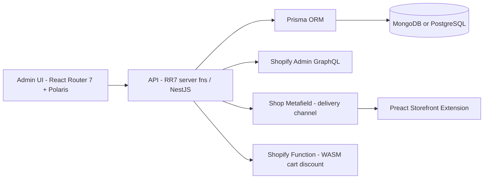

# Feature Tech Design Author (v2.3)

This skill helps a Tech Lead create `03-tech-design.md` (overall architecture + Prisma schema + module breakdown + file structure + lightweight API contract) before Dev starts coding.

> **v2.3 NOTE (2026-05-05):** a **lightweight API Contract** is back as **Section 11** — overview + 1-row-per-endpoint summary table only. Full OpenAPI YAML is still OUT. Request/response shapes live in Zod schema files (referenced from Section 4). Total Tech Design sections: **12** (was 11). Open questions renumbered Section 11 → Section 12.
>
> **v2.2 NOTE (2026-05-05):** the inline OpenAPI 3.x API contract was REMOVED. v2.3 partially reverses that — only the 1-line endpoints summary is back; full OpenAPI stays out.
>
> **v2.1 NOTE (2026-05-05):** the Prisma schema design (DDL, CHECK / Zod refines, indexes, FK, ON DELETE) is **Section 3** of this Tech Design. It used to live in SRS Section 8 — it has moved here because schema design is the Tech Lead's call, not the BA's.

This document is the **technical map** — Dev will follow it to code, QA will follow it to write integration tests.

## When to use this skill

- The SRS is approved and a technical plan is needed before coding.
- The feature touches multiple modules/services → need architectural alignment.
- New module / new endpoints → need module breakdown + file structure before FE/BE develop in parallel.
- Update tech design when requirements change significantly.

## Required output

Single file: `docs/phases/<phase-slug>/features/<feature-slug>/03-tech-design.md`

## Procedure

### Step 1: Read inputs (REQUIRED, ALL OF THEM)
- **Resolve `<phase-slug>` first**: if not given, run `grep -l "<slug>" docs/phases/*/00-prd.md` — the matching phase folder is `<phase-slug>`. Ask the user if 0 or >1 matches.
- `docs/phases/<phase-slug>/00-prd.md` — to confirm phase scope and constraints.
- `docs/phases/<phase-slug>/features/<slug>/01-srs.md` — especially **Section 5 (data model & validation rules — the source of truth for schema design)**, Section 3 (business rules → CHECK constraints), Section 4 (enums), Section 6 (state transitions), Section 7 (runtime), Section 9 (implementation notes), Section 11 (user stories).
- The current code base — learn the patterns, naming conventions, and frameworks in use. Use `glob`/`grep` to explore the structure before proposing anything.
- `docs/_conventions/` — coding style, branch naming, workflow standard.
- Confirm DB choice for the project (Postgres or MongoDB — both via Prisma).

### Step 2: Plan the architecture
- Draw the data flow diagram (Mermaid).
- Identify: Admin UI → API → Prisma → DB; plus Shopify metafield writes, Shopify Function (cart discount), and Preact storefront extension reads.
- Decide which modules are new vs. reused.

### Step 3: Write `03-tech-design.md`
Following the 12-section structure below. Section 3 is the Prisma schema design; endpoints are listed informally in Section 2 (Module breakdown) and Section 4 (File/folder structure), then summarised as a 1-row-per-endpoint table in Section 11 (API Contract). Open questions are Section 12.

## Frontmatter for `03-tech-design.md`

```yaml
---
feature_slug: <slug>
phase_slug: <phase-slug>
doc_type: tech-design
version: 1.0
status: draft
owner: "@<tech-lead-username>"
reviewers: ["@<be-lead>", "@<fe-lead>", "@<devops>", "@<security>"]
created_at: <YYYY-MM-DD>
last_updated: <YYYY-MM-DD>
links:
  jira_epic: <from SRS>          # optional — omit if no Jira (Git branch `feature/<slug>` is mandatory)
  related_docs:
    - ./01-srs.md
    - ../../phases/<phase-slug>/00-prd.md
depends_on:
  - ./01-srs.md
consumed_by: []
---
```

## Structure of `03-tech-design.md` (12 sections)

**Sections**: 1. Architecture · 2. Module breakdown · 3. Database schema (Prisma) · 4. File/folder structure · 5. Data flow · 6. Validation · 7. Error handling · 8. Performance · 9. Security · 10. Migration · 11. **API Contract (lightweight: overview + endpoints summary table)** · 12. Open questions.

```markdown
# Tech Design: <Feature name>

## 1. Architecture



2-3 sentence summary of the architecture. State explicitly: project framework (React Router 7 monolith OR NestJS backend), DB engine (Postgres or MongoDB), and storefront delivery (metafield + Preact extension, or Shopify Function).

## 2. Module breakdown
| Module | Responsibility | New / Reuse | Main file |
|---|---|---|---|
| `example-feature-api` | REST endpoints for admin CRUD | New | `app/api/v1/example-feature/` (RR7) or `src/modules/example-feature/api/` (NestJS) |
| `example-feature-service` | Business logic + Shopify metafield writer | New | `app/services/example-feature-service.server.ts` (RR7) or `src/modules/example-feature/domain/services/` (NestJS) |
| `example-feature-extension` | Storefront Preact bundle reading metafield | New | `extensions/example-feature-storefront/` |
| `example-feature-discount` | Shopify Function (WASM) for cart discount | New | `extensions/example-feature-discount/` |
| `shopify-client` | Shopify GraphQL Admin wrapper | Reuse | `app/shared/shopify/` or `src/shared/shopify/` |

## 3. Database schema (Prisma)

> **Source**: SRS Section 5 (field semantics — Field/Type/Required/Default/Rule). Translate every field there into a concrete Prisma model.

### 3.A — PostgreSQL (Prisma + DDL)
- Prisma model with `@db.Check("...")` for every enum and every conditional rule from SRS Section 5; provide equivalent raw SQL DDL block.
- Every enum field → `CHECK (col IN ('val1', 'val2'))`. Every conditional rule from Section 5 → corresponding CHECK.
- Foreign keys with explicit `onDelete:` policy (`Cascade` / `Restrict` / `SetNull`).

### 3.B — MongoDB (Prisma + Zod refines)
- Prisma model with `@@map`, embedded composite types where appropriate. No `@db.Check`.
- Every constraint that would have been a CHECK → Zod refine in a "Validation enforcement" subsection. Enums use `z.enum(...)`; cross-field rules use `superRefine`.
- Document relation-cleanup behavior (no FK in Mongo) inline.

### 3.Common
- Indexes on `tenant_id`/`shop_id` + `status` + FKs / references.
- Standard columns on every entity: `created_at`, `updated_at`, `deleted_at`, `version`, `created_by`, `updated_by`.

### 3.Cross-check
- [ ] Every field in SRS Section 5 appears in Section 3.
- [ ] Every measurable rule from SRS Section 3 with a column-level constraint → `@db.Check` (Postgres) or Zod refine (Mongo).
- [ ] Every enum from SRS Section 4.2 → `@db.Check` (Postgres) or `z.enum(...)` (Mongo).

## 4. File/folder structure

> **Pick template based on project**:
> - Repo using **React Router 7 server functions / loaders / actions** → **Template A**.
> - Repo using a **separate NestJS backend service** → **Template B**.

### Template A — React Router 7 monolith (current repo pattern)
```
app/
├── services/<slug>-service.server.ts        # service layer (.server.ts only)
├── api/v1/<slug>/                           # REST endpoints (route handlers)
│   ├── create.ts
│   ├── update.ts
│   ├── get.ts
│   ├── list.ts
│   └── change-status.ts
├── modules/<slug>/                          # admin UI feature
│   ├── pages/
│   ├── components/
│   ├── hooks/
│   └── models/
├── schemas/<slug>/                          # Zod schemas + enums
└── middlewares/
prisma/schema/<slug>.prisma                   # Prisma model (Postgres or Mongo)
extensions/<slug>-storefront/                 # Preact storefront extension
extensions/<slug>-discount/                   # Shopify Function (WASM)
```

### Template B — NestJS backend + separate UI
```
src/modules/<slug>/
├── api/controllers/
├── api/dto/
├── domain/entities/
├── domain/services/
├── infrastructure/repositories/
├── infrastructure/migrations/                # Prisma migrations
└── tests/
prisma/schema.prisma                          # all models in single file
apps/admin-ui/                                # if a separate React Router app
extensions/<slug>-storefront/                 # Preact
extensions/<slug>-discount/                   # Shopify Function
```

## 5. Data flow
### Flow 1: Admin creates a campaign
1. Admin UI (React Router 7 + Polaris form) submits → POST `/api/v1/example-feature/create` (RR7) or POST `/example-feature` (NestJS)
2. Endpoint validates Zod DTO (schema mirrors SRS Section 5)
3. Service checks business rules (SRS Section 3) and writes via Prisma
4. Service writes shop metafield (delivery channel) via Shopify Admin GraphQL
5. Returns DTO

### Flow 2: Storefront resolve
1. Storefront Preact extension loads the shop metafield (no API roundtrip needed)
2. Preact runtime filters active campaigns + applies SRS Section 7 ordering
3. If a discount applies, Shopify Function (WASM) evaluates the cart and emits the discount

## 6. Validation
- All DTOs validated with Zod schemas mirroring SRS Section 5 (`app/schemas/<slug>/` or `src/modules/<slug>/dto/`).
- Whitelist input — reject unknown fields.
- Conditional rules from SRS go through `superRefine`.
- For MongoDB projects, the same Zod schema also enforces the rules that would have been Postgres CHECK constraints (per Section 3.B above).

## 7. Error handling strategy
- **Validation errors** (4xx): return `{ code, message, field, details }`
- **Business rule violations** (422): code prefix `BR_`
- **Not found** (404): code `NOT_FOUND`
- **Server errors** (5xx): log full context, alert via Sentry, response must not leak internal info
- **Resolver soft-fail**: empty recommendation/empty offer is NOT a 500 (per SRS 7.4, 7.5)

## 8. Performance budget
| Endpoint | p50 | p95 | p99 |
|---|---|---|---|
| POST /campaigns | 100ms | 250ms | 500ms |
| GET /campaigns | 50ms | 150ms | 300ms |
| Storefront extension hydrate | 30ms | **120ms** | 250ms |
| Shopify Function eval | 5ms | 20ms | 40ms |

- Cache strategy: shop-level metafield is the cache (no extra Redis needed for storefront).
- FE bundle size: max 50KB gzip for admin module, 15KB for Preact storefront extension.
- DB queries: indexes per Section 3 above.

## 9. Security
- AuthN: every admin endpoint requires Shopify session token (App Bridge / HMAC verify).
- AuthZ: a campaign is only accessible by its shop owner. Repository always filters by `shop_id`.
- Rate limit: admin 60/min/shop, Shopify Function inherits Shopify platform limits.
- Input validation: Zod whitelist, reject unknown fields.
- PII: cart context is not logged raw (mask product_gid in logs).
- Metafield namespace: use a unique `$app:<slug>` namespace; never use the public namespace.

## 10. Migration & rollout plan

> Source schema: **Section 3** above. The migration applies that Prisma model.

### DB migration
- Postgres: `npx prisma migrate dev --name create_<slug>` → produces SQL migration files (reversible by hand-written down).
- MongoDB: `npx prisma db push` (Mongo has no migrations table — document the schema change in the PR).
- Run during off-peak hours.

### Feature flag
- Name: `<slug>_enabled`
- Default: `false`

### Rollout
1. Internal test shop (1 day)
2. 5 beta shops (3 days)
3. 10% rollout (2 days)
4. 100%

### Rollback plan
- Toggle the feature flag to `false` (instant)
- Metafield: leave in place (extension reads `enabled=false`)
- DB schema retained (do not drop in the first release)

## 11. API Contract

> **Lightweight only**: ONE row per endpoint. NO request/response schemas, NO example payloads, NO OpenAPI YAML. Authoritative request/response shapes live in the Zod schema files referenced from Section 4. Story column links to user-story IDs in SRS Section 11.

### Overview

- **Base URL (auth)**: `/api/v1/<resource>`
- **Base URL (public)**: `/api/public/<resource>` (if applicable)
- **Auth**: Bearer token (Shopify session) / Public token / HMAC (webhooks)
- **Content-Type**: `application/json`
- **Idempotency**: <state idempotency key, if any — otherwise "n/a">

### Endpoints summary

> **Story** column = stable story ID from SRS Section 11 (e.g. `US-01`, `STORY-01`) or Jira issue key (`PROJ-XXX`) if the team uses Jira. Jira is optional; Git branch (`feature/<slug>`) is mandatory.

| Method | Path | Auth | Description | Story |
|---|---|---|---|---|
| POST | `/api/v1/<resource>/create` | ✅ | Create a new <resource> | US-01 / PROJ-XXX |
| GET | `/api/v1/<resource>/get-list` | ✅ | List <resource> with pagination + filter | US-02 / PROJ-XXX |
| GET | `/api/v1/<resource>/get-detail/:id` | ✅ | Get one <resource> by id | US-03 / PROJ-XXX |
| POST | `/api/v1/<resource>/update/:id` | ✅ | Update an existing <resource> | US-04 / PROJ-XXX |
| DELETE | `/api/v1/<resource>/delete` | ✅ | Soft-delete one or many <resource> | US-05 / PROJ-XXX |

## 12. Open questions
- [ ] Question 1 — waiting on whom
- [ ] Question 2 — waiting on whom
```

## Writing rules

1. **Every schema field MUST match SRS Section 5 name** — do not change `discount_value` to `discountValue` (camelCase belongs to the runtime client, not the DTO contract).
2. **Every error code has a clear prefix** — `BR_` for business rules, `VAL_` for validation, plus standard `NOT_FOUND`/`UNAUTHORIZED`/`FORBIDDEN`.
3. **File structure must match the chosen template (A or B)** — read the code before proposing anything; do not invent a new structure.
4. **Endpoints listed twice — informally + summary table**:
   - Section 2 (Module breakdown) / Section 4 (File structure) → mention route files alongside the module / file tree.
   - Section 11 (API Contract) → 1-row-per-endpoint summary table (Method · Path · Auth · Description · Story). NO request/response schemas inline — the Zod schema files in Section 4 (`app/schemas/<slug>/`) are the source of truth. Do NOT write full OpenAPI YAML.
5. **Performance budget must align with SRS Section 9**.
6. **Do not skip the security section** — even for simple features.
7. **Storefront delivery must be specified** — metafield channel, Preact extension, and/or Shopify Function — pick explicitly.
8. **Jira optional, Git mandatory** — `links.jira_epic` may be omitted if the team doesn't use Jira. Story column in Section 11 accepts SRS §11 stable IDs (`US-01`) or Jira keys (`PROJ-XXX`). Git branch (`feature/<slug>`) is mandatory.

## Cross-check before handoff

- [ ] Every entity in SRS Section 4 has a corresponding Prisma model in Section 3
- [ ] Every field in SRS Section 5 appears in Section 3 (Prisma schema)
- [ ] Every enum value matches SRS Section 4.2 (enforced via `@db.Check` Postgres or `z.enum` Mongo in Section 3)
- [ ] Every business rule in SRS Section 3 with a column-level constraint → CHECK or Zod refine in Section 3
- [ ] Every business rule in SRS Section 3 has a corresponding data flow in Section 5
- [ ] Performance targets match the SRS
- [ ] Migration plan (Section 10) references the Section 3 schema
- [ ] FKs (Postgres) all have an explicit `onDelete` policy
- [ ] Standard columns (`created_at`, `updated_at`, `deleted_at`, `version`, `created_by`, `updated_by`) on every entity
- [ ] Endpoints listed in Section 2 / Section 4 with method + path + route file
- [ ] Section 11 API Contract has ONE row per endpoint (Method · Path · Auth · Description · Story) — no inline schemas
- [ ] Every Section 11 endpoint maps to a Story ID from SRS Section 11
- [ ] Storefront delivery (metafield / Preact / Shopify Function) is explicit

## Anti-patterns (DO NOT)

- ❌ Skipping Section 3 — schema design is the Tech Lead's call, not the BA's
- ❌ Section 3 missing fields that exist in SRS Section 5
- ❌ Section 3 missing CHECK constraints (Postgres) / Zod refines (Mongo) for measurable rules in SRS Section 3
- ❌ FK without explicit `onDelete` policy
- ❌ Propose a file structure without reading the existing code base
- ❌ Mix Template A and Template B in the same project
- ❌ Rename fields between SRS and the Prisma schema (Section 3)
- ❌ Skip error handling / security / performance
- ❌ Forget the migration & rollout plan
- ❌ Skip the feature flag (every new feature needs a flag for rollback)
- ❌ Writing full OpenAPI YAML in tech design — keep it as 1-row-per-endpoint table in Section 11
- ❌ Inlining request/response shapes in API Contract — they live in Zod schemas referenced from Section 4
- ❌ Skip Section 11 — even with informal endpoints in Section 2 / Section 4, the summary table is the canonical list FE/BE consume
- ❌ Forget to map each Section 11 endpoint to a Story ID from SRS Section 11
- ❌ Forget to specify storefront delivery channel (metafield / Preact / Shopify Function)

## After creation

1. Report the file created (`docs/phases/<phase-slug>/features/<slug>/03-tech-design.md`).
2. List items needing BE/FE/DevOps confirmation (new libs, new infra).
3. Suggest next steps:
   - BE Dev uses `feature-backend-impl`
   - FE Dev uses `feature-frontend-impl`

## Example triggers

- "Cart-<feature-slug> SRS is done, write the tech design"
- "Plan the architecture for the subscription feature"
- "Design the module breakdown for the admin app"
- "Design the file structure for this feature"
- "Migration plan for this feature"
- "Cart-<feature-slug> SRS is done — write the tech design"
