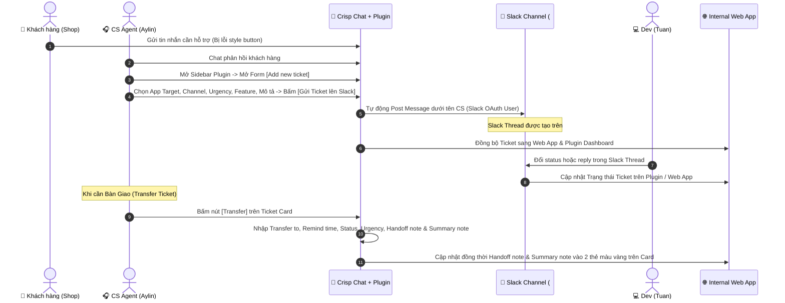

# Demo Wireframe & Luồng Vận Hành Chuẩn: Crisp ➔ Slack ➔ Internal Web App

Tài liệu này cập nhật **100% chuẩn xác theo các bản mockup thiết kế thực tế** mà bạn đã cung cấp cho 3 nền tảng: **Crisp Chat (Plugin)**, **Slack Channel/Thread**, và **CS Dashboard**.

---

## 🔄 SƠ ĐỒ LUỒNG TỔNG QUAN (WORKFLOW OVERVIEW)



---

## 🎨 1. FORM [+ ADD NEW TICKET] (Từ Crisp Plugin - Ảnh 1)

Khi CS bấm tạo ticket mới từ Crisp Sidebar:

```
┌─────────────────────────────────────────────────────────────────┐
│  Add new ticket                                              ▲  │
├─────────────────────────────────────────────────────────────────┤
│  App Target: [ Avis Product Options                         ▾ ] │
├─────────────────────────────────────────────────────────────────┤
│  Slack Channel: [ #apo-paid-task                            ▾ ] │
├────────────────────────────────┬────────────────────────────────┤
│  Status: [ Chờ check        ▾ ]│ Urgency: [ 1                 ▾ ]│
├────────────────────────────────┴────────────────────────────────┤
│  Feature: [ Live preview                                      ] │
├─────────────────────────────────────────────────────────────────┤
│  Request Content                                                │
│  ┌───────────────────────────────────────────────────────────┐  │
│  │ Mô tả yêu cầu...                                          │  │
│  └───────────────────────────────────────────────────────────┘  │
├─────────────────────────────────────────────────────────────────┤
│                  [      Gửi Ticket lên Slack      ]             │
└─────────────────────────────────────────────────────────────────┘
```

---

## 🔄 2. FORM [TRANSFER TICKET] KÈM CẢ SUMMARY NOTE & HANDOFF NOTE (Ảnh 2 Tinh Chỉnh)

Khi CS bấm nút `Transfer` trên bất kỳ Ticket Card nào:

```
┌─────────────────────────────────────────────────────────────────┐
│  Transfer ticket                                             ▲  │
├────────────────────────────────┬────────────────────────────────┤
│  Transfer to: [ Aylin       ▾ ]│ Remind: [ May 8th, 8:00 AM  ▾ ]│
├────────────────────────────────┼────────────────────────────────┤
│  Status: [ Chờ check        ▾ ]│ Urgency: [ 1                 ▾ ]│
├────────────────────────────────┴────────────────────────────────┤
│  Handoff / Transfer note (Ghi chú ca trực này)                  │
│  ┌───────────────────────────────────────────────────────────┐  │
│  │ Ghi chú cho ca sau: Đã báo Dev Tuan check CSS...          │  │
│  └───────────────────────────────────────────────────────────┘  │
├─────────────────────────────────────────────────────────────────┤
│  Summary note (Tóm tắt vấn đề gốc - Xem/Cập nhật dùng lâu dài)  │
│  ┌───────────────────────────────────────────────────────────┐  │
│  │ Tóm tắt: Khách báo lỗi button style ở collection page...  │  │
│  └───────────────────────────────────────────────────────────┘  │
├─────────────────────────────────────────────────────────────────┤
│                     [      Submit Note      ]                   │
└─────────────────────────────────────────────────────────────────┘
```

---

## 🏪 3. STORE INFO & THÊM SUB-DOMAIN TRACKING (Ảnh 3)

Khung thông tin Store trên Crisp Sidebar với tính năng **Add Sub-Domain** để theo dõi toàn bộ ticket liên quan:

```
┌─────────────────────────────────────────────────────────────────┐
│  Store info                                                  ▲  │
├─────────────────────────────────────────────────────────────────┤
│  Crisp URL: [ Crisp URL Crisp chat link...                    ] │
├──────────────────────────────────────────────────┬──────────────┤
│  Store domain: [ Store domain Store URL          ]│  [ + ] Add   │
├──────────────────────────────────────────────────┴──────────────┤
│                                                                 │
│  App Plan:     [ Premium ]      Widget Status:  [ Active ]      │
│                                                                 │
│  Ego cart:     [ Not Installed ] App Plan:      [ Basic ]       │
│                                                                 │
└─────────────────────────────────────────────────────────────────┘
```

---

## 📊 4. CS DASHBOARD & THẺ TICKET SONG SONG VỚI NOTE TRANSFER CASE & SUMMARY NOTE (Ảnh 4 & 5)

Giao diện Dashboard xem và quản lý danh sách Ticket (trên Crisp Sidebar hoặc Web App):

### Thanh Công Cụ & Bộ Lọc Trên Cùng:
`[ APO ]` `[ APB ]` `[ ACS ]` (App Tabs)
`[ All ▾ ]` `[ Today ]` `[ Assigned to me ]` `[ Unread ]` `[ Done ]` `[ + ]`
`🔍 Search by request` `[ 🔍 ]` `[ ≡ ]` `[ ⇅ ]`

---

### Cấu Trúc Khung Thẻ Ticket (Card Layout - 2 Cột Song Song):

#### 🟢 View Mode (Khi xem thông thường - Ảnh 5):

```
┌──────────────────────────────────────────────┬──────────────────────────────┐
│ 🟡 Fl up 1  🔴 5                             │ 📝 Note transfer case        │
│ Channel: apo-urgent-case                     │ ┌──────────────────────────┐ │
│ Store URL: 61cde3-42.myshopify.com           │ │ Ghi chú giao ca / note   │ │
│ Assigned to: Aylin  | at: 6:46 pm 13/08/2026 │ │ chuyển giao của CS...    │ │
│ Request: Khách nhận order mất option...      │ └──────────────────────────┘ │
│ Feature: Live preview                        │ 📄 Summary note              │
│                                              │ ┌──────────────────────────┐ │
│  [ Edit ]   [ View Slack ]   [ Transfer ]    │ │ Tóm tắt nội dung ticket  │ │
│                                              │ └──────────────────────────┘ │
└──────────────────────────────────────────────┴──────────────────────────────┘
```

#### 🟡 Edit Mode (Khi nhấn chỉnh sửa Ticket - Ảnh 4):

```
┌──────────────────────────────────────────────┬──────────────────────────────┐
│ 🟡 Dang check  🔴 5                          │ 📝 Note transfer case        │
│ Channel: apo-urgent-case                     │ ┌──────────────────────────┐ │
│ Status:  [ Dang check                     ▾ ]│ │ Ghi chú giao ca...       │ │
│ Feature: [ Live preview                   ▾ ]│ └──────────────────────────┘ │
│ Urgency: [ 1                              ▾ ]│ 📄 Summary note              │
│ Sumary:                                      │ ┌──────────────────────────┐ │
│ ┌──────────────────────────────────────────┐ │ │ Tóm tắt nội dung...      │ │
│ │ Summarize...                             │ │ └──────────────────────────┘ │
│ └──────────────────────────────────────────┘ │                              │
│ [ Add tag ]          [ Cancel ] [Save changes]                              │
└──────────────────────────────────────────────┴──────────────────────────────┘
```

---

## 🎯 ĐIỂM NỔI BẬT ĐÃ ĐƯỢC CHUẨN HÓA

1. **Khung Note Transfer Case & Summary Note màu vàng**: Nằm ngay cột bên phải của từng thẻ Ticket Card, hiển thị độc lập rõ ràng.
2. **Theo vết Sub-domain**: Nút `+` trong mục Store Info cho phép gán thêm Sub-domain của merchant để gom toàn bộ ticket liên quan về cùng một shop.
3. **Form Add & Transfer chuẩn form**: Hỗ trợ nhập cả `Handoff note` (cho ca sau) và xem/chỉnh sửa `Summary note` (tóm tắt lâu dài) ngay trên Modal Transfer.
